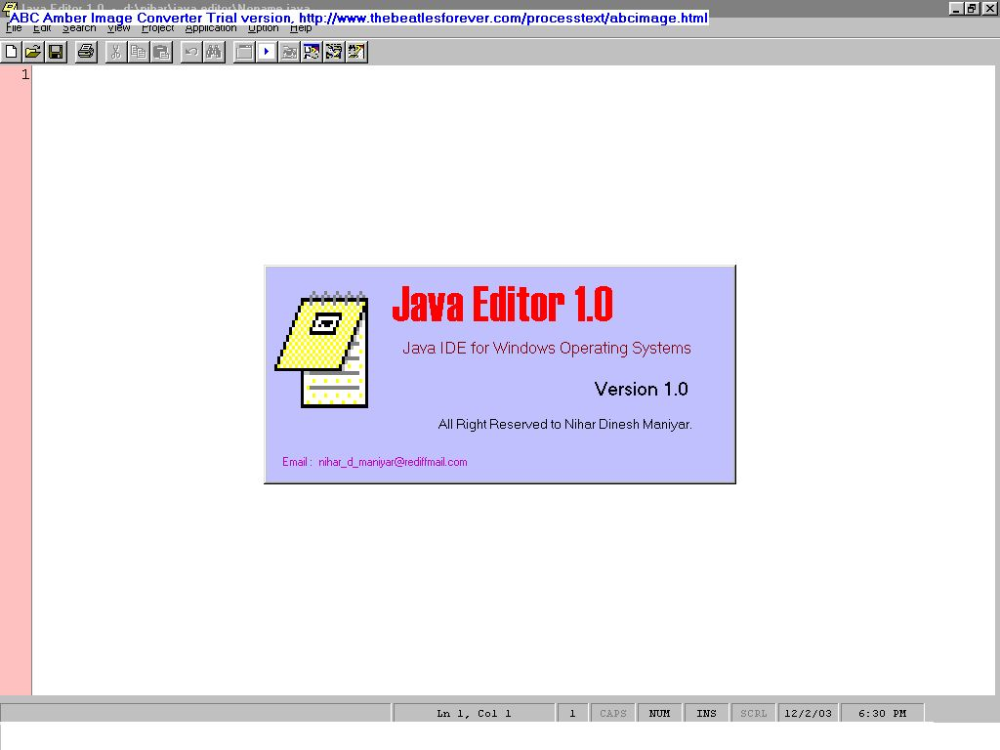



## \_\!\!\!\!\*JAVA EDITOR \(IDE FOR JAVA\)\*\!\!\!\!

### Description

This application is IDE for Java. I have created this editor for myself and you all.

It allows us to write, compile, view errors and execute Java programs and applets.

It allows us to set path (Java path, classpath) and Environment Settings.

It allows us to create javadoc and jar files.

It allows us to access Browser and Command Prompt.
 
### More Info
 
After executing this application, the user has to

select options menu -> setup...

and specify the following paths :-

Java Bin directory

Java Api Documentation

Command Prompt path

Browser Path

Default Directory path

The user should build the .exe executable by

selecting File->Make from VB IDE

Open Redirect.dsw in VC++ IDE and build Redirect.exe

It makes developing java programs faster, simpler and efficient

             |
---                |---
**Submitted On**   |2003-12-02 18:15:12
**By**             |[NIHAR DINESH MANIYAR](https://github.com/Planet-Source-Code/PSCIndex/blob/master/ByAuthor/nihar-dinesh-maniyar.md)
**Level**          |Advanced
**User Rating**    |4.9 (128 globes from 26 users)
**Compatibility**  |VB 6\.0
**Category**       |[Complete Applications](https://github.com/Planet-Source-Code/PSCIndex/blob/master/ByCategory/complete-applications__1-27.md)
**World**          |[Visual Basic](https://github.com/Planet-Source-Code/PSCIndex/blob/master/ByWorld/visual-basic.md)
**Archive File**   |[JAVA\_EDITO1679081222003\.zip](https://github.com/Planet-Source-Code/nihar-dinesh-maniyar-java-editor-ide-for-java__1-50260/archive/master.zip)

